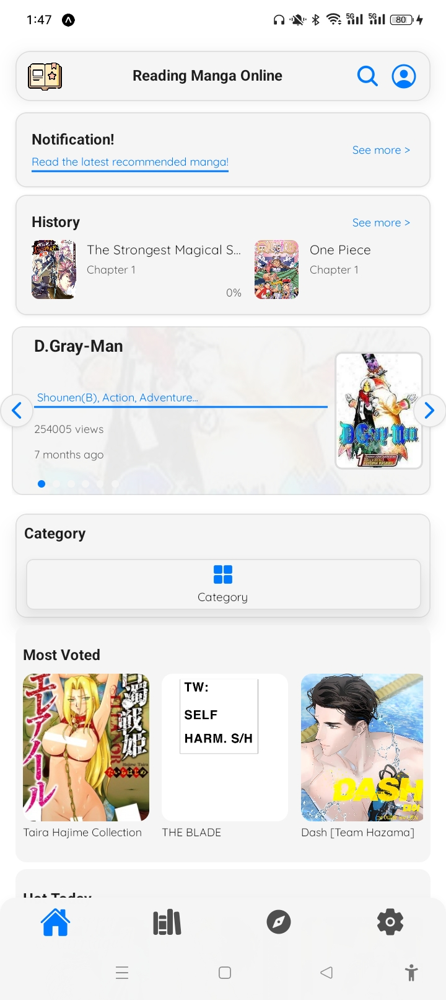
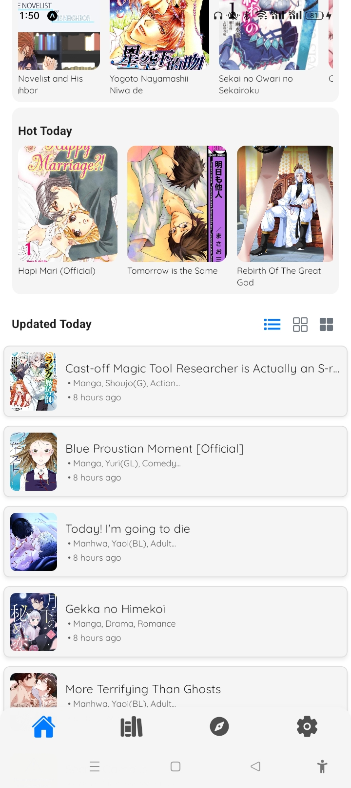
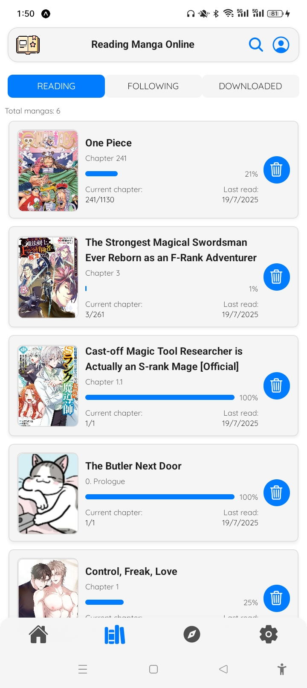
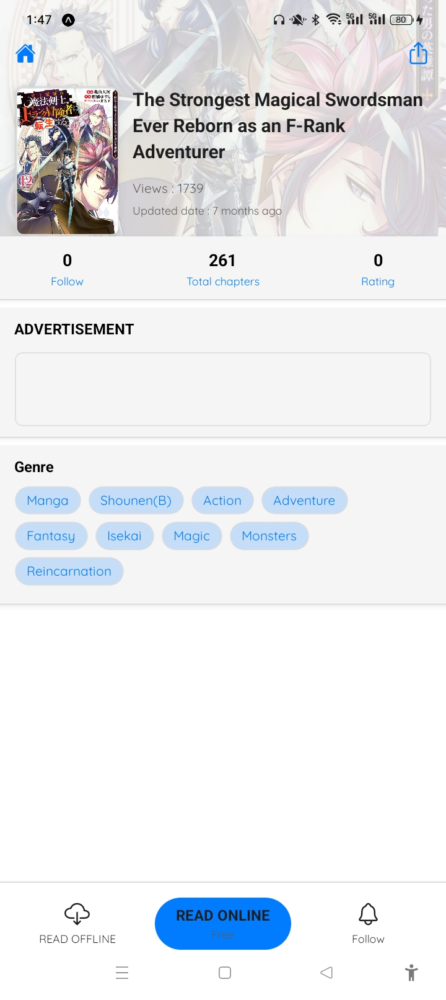

# 📚 Manga-En

**Manga-En** is a lightweight Vietnamese Manga reader app designed for **offline reading**, built with **React Native + Expo** and quickly styled using **Tailwind CSS**.

> ✅ No ads – No account needed – Just open the app and read!

---

## 📱 Download the App

- 📦 Prebuilt APK file for Android:  
👉 [Download Manga-En.apk](https://github.com/dongdoidoithay/Release/raw/main/Manga-En/manga-en-release.apk)

> **Note:** On Android, you need to enable **“Install apps from unknown sources”** to install the APK file.

---

## 🖼️ App Interface

| Home Screen | Manga Group List | Mangas in a Group |
|-------------|------------------|--------------------|
|  |  |  |

| Manga Details | Manga Reader |
|---------------|--------------|
|  |  |

---

## ⚙️ Main Features

- 📂 **Offline Manga reading** from local storage  
- 📁 Always up-to-date with the latest Mangas by date  
- 🧾 Supports organizing Mangas into groups/chapters  
- 🖼️ Smooth image loading with swipe support  
- 🌙 Simple and user-friendly UI, optimized for mobile

---

## 🛠️ Technologies Used

- ⚛️ **React Native** (via [Expo](https://expo.dev/))  
- 💨 **Tailwind CSS** (via `nativewind`)  
- 📁 `expo-file-system` & `expo-document-picker` for accessing local folders  
- 🤖 Developed with the help of AI using **[Cursor](https://www.cursor.so/)** (free plan)

> I don’t use Android Studio or VSCode – all code was written and refactored entirely in **Cursor**, with AI support from start to finish.

---

## ⚡ Development Speed

- ⏱️ From idea → MVP in less than a week  
- 🧠 AI-assisted component development, logic creation, and refactoring  
- 🎯 Fully focused on user experience

---

## 📎 Links

- 🌐 GitHub: [dongdoidoithay/Release - Manga-En](https://github.com/dongdoidoithay/Release/tree/main/Manga-En)  
- 📦 Download APK: [app-release.apk](https://github.com/dongdoidoithay/Release/raw/main/Manga-En/manga-en-release.apk)  
- 📦 Download APK for Amazon: [app-release.apk](https://www.amazon.com/s?i=mobile-apps&rh=p_4%3AFreeGameStudio&search-type=ss)

---

## 🔖 License

This project is released under the [MIT License](LICENSE).
