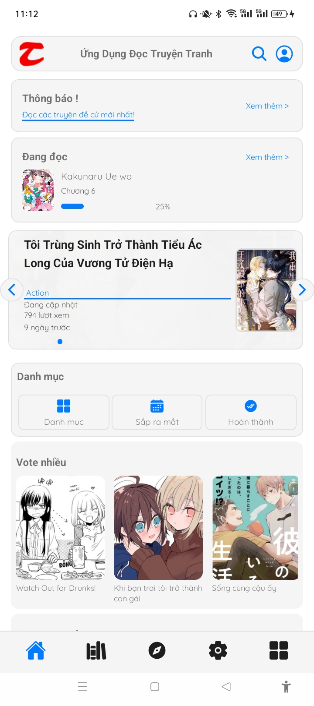
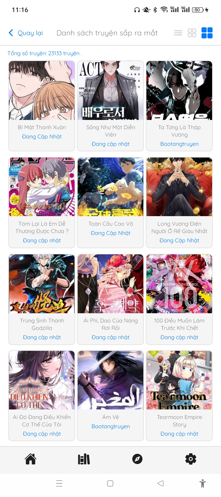
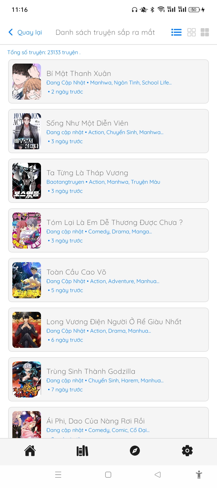
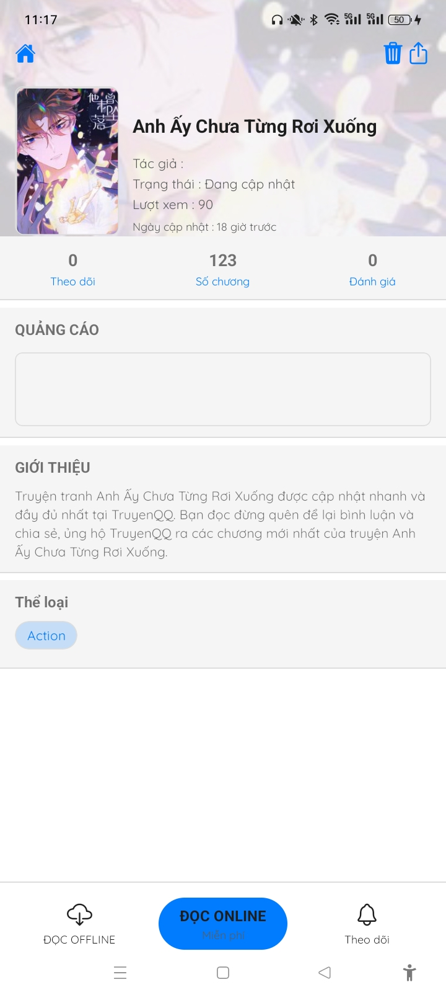

# 📚 ReadMangaVN

**ReadMangaVN** là một ứng dụng đọc truyện tranh tiếng Việt, đơn giản – nhẹ – đọc **offline**, được phát triển bằng **React Native + Expo**, với UI được thiết kế nhanh chóng bằng **Tailwind CSS**.

> ✅ Không quảng cáo – Không cần tài khoản – Không cần mạng – Chỉ mở app và đọc truyện từ bộ nhớ máy!

---

## 📱 Tải ứng dụng

- 📦 File APK cài đặt sẵn cho Android:  
👉 [Download ReadMangaVN.apk](https://github.com/dongdoidoithay/Release/raw/main/ReadMangaVN/app-release.apk)

> **Lưu ý:** Trên Android, bạn cần bật quyền **“Cài đặt ứng dụng từ nguồn không xác định”** để cài file APK.

---

## 🖼️ Giao diện ứng dụng

| Màn hình chính | Danh sách nhóm truyện | Danh sách truyện trong nhóm |
|----------------|------------------------|------------------------------|
|  |  |  |

| Chi tiết truyện | Trình đọc truyện |
|------------------|------------------|
|  |  |

---

## ⚙️ Chức năng chính

- 📂 **Đọc truyện offline** từ bộ nhớ máy
- 📁 Quét thư mục chứa truyện tự động
- 🧾 Hỗ trợ cấu trúc truyện theo nhóm / chương
- 🖼️ Hiển thị ảnh mượt mà, hỗ trợ vuốt trang
- 🌙 Giao diện đơn giản, dễ sử dụng, tối ưu cho điện thoại

---

## 🛠️ Công nghệ sử dụng

- ⚛️ **React Native** (qua [Expo](https://expo.dev/))
- 💨 **Tailwind CSS** (qua `nativewind`)
- 📁 `expo-file-system` & `expo-document-picker` để truy cập thư mục cục bộ
- 🤖 Được hỗ trợ viết bằng AI trên **[Cursor](https://www.cursor.so/)** (free plan)

> Mình không sử dụng Android Studio hay VSCode – toàn bộ code được viết và refactor ngay trong **Cursor**, có AI hỗ trợ từ đầu đến cuối.

---

## ⚡ Tốc độ phát triển

- ⏱️ Từ ý tưởng → MVP trong chưa đến 1 tuần
- 🧠 AI hỗ trợ viết component, tạo logic và refactor nhanh chóng
- 🎯 Tập trung tối đa vào trải nghiệm người dùng

---

## 📎 Liên kết

- 🌐 GitHub: [dongdoidoithay/Release - ReadMangaVN](https://github.com/dongdoidoithay/Release/tree/main/ReadMangaVN)
- 📦 Tải APK: [app-release.apk](https://github.com/dongdoidoithay/Release/raw/main/ReadMangaVN/app-release.apk)

---

## 🔖 Giấy phép

Dự án được phát hành với giấy phép [MIT License](LICENSE).

----
# 📚 ReadMangaVN

**ReadMangaVN** is a lightweight, Vietnamese comic/manga reader app designed for smooth **offline reading**, built using **React Native + Expo** with a clean UI powered by **Tailwind CSS**.

> ✅ No ads – No login – No internet required – Just open the app and read comics from your device storage!

---

## 📱 Download the App

- 📦 Pre-built APK for Android:  
👉 [Download ReadMangaVN.apk](https://github.com/dongdoidoithay/Release/raw/main/ReadMangaVN/app-release.apk)

> **Note:** On Android, you must enable **“Install from unknown sources”** to install the APK.

---

## 🖼️ App Screenshots

| Home Screen | Comic Groups | Chapter List |
|-------------|---------------|---------------|
|  |  |  |

| Comic Details | Reading View |
|----------------|----------------|
|  |  |

---

## ⚙️ Key Features

- 📂 **Offline comic reading** from local storage
- 📁 Automatically scan selected folders for comics
- 📑 Supports comic organization by groups and chapters
- 🖼️ Smooth image rendering with swipe navigation
- 🌙 Clean, minimal UI optimized for mobile use

---

## 🛠️ Tech Stack

- ⚛️ **React Native** (via [Expo](https://expo.dev/))
- 💨 **Tailwind CSS** (via `nativewind`)
- 📁 Uses `expo-file-system` & `expo-document-picker` for local file access
- 🤖 Developed with AI assistance using **[Cursor](https://www.cursor.so/)** (free plan)

> No Android Studio or VSCode used — everything was built, refactored, and shipped directly in **Cursor** with AI help.

---

## ⚡ Development Speed

- ⏱️ From idea → MVP in less than a week
- 🧠 AI-assisted UI design, logic creation, and refactoring
- 🎯 Focused entirely on delivering a smooth user experience

---

## 📎 Links

- 🌐 GitHub: [dongdoidoithay/Release - ReadMangaVN](https://github.com/dongdoidoithay/Release/tree/main/ReadMangaVN)
- 📦 APK Download: [app-release.apk](https://github.com/dongdoidoithay/Release/raw/main/ReadMangaVN/app-release.apk)

---

## 🔖 License

This project is released under the [MIT License](LICENSE).

