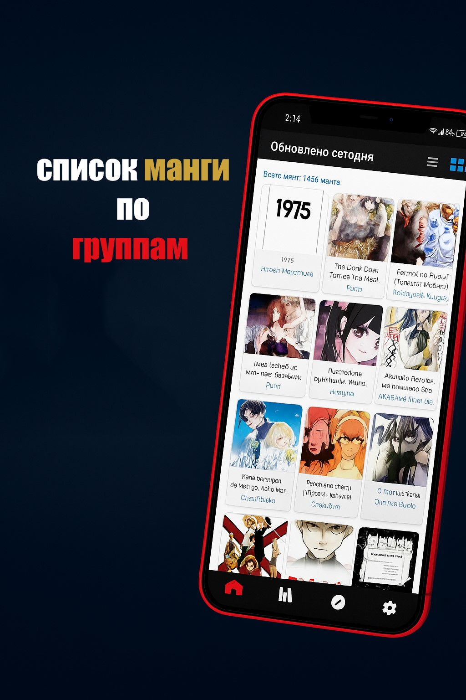
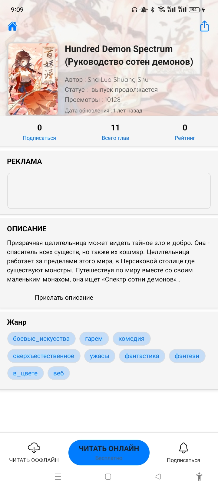

# 📚 Манга-Яой

**Манга-Яой** — это лёгкое приложение для чтения вьетнамской Манга-Яой **в оффлайне**, разработанное с помощью **React Native + Expo** и быстро оформленное с использованием **Tailwind CSS**.

> ✅ Без рекламы – Без регистрации – Без интернета – Просто откройте приложение и читайте мангу из памяти устройства!

---

## 📱 Скачать приложение

- 📦 Предварительно собранный APK-файл для Android:  
👉 [Скачать Манга-Яой.apk](https://github.com/dongdoidoithay/Release/raw/main/Манга-Яой/app-release.apk)

> **Примечание:** На Android необходимо включить **«Установка из неизвестных источников»**, чтобы установить APK.

---

## 🖼️ Интерфейс приложения

| Главный экран | Группы Манга-Яой | Список глав |
|---------------|----------------|--------------|
|  |  |  |

| Подробности Манга-Яой | Просмотр чтения |
|-------------------|-----------------|
|  |  |

---

## ⚙️ Основные функции

- 📂 **Чтение Манга-Яой оффлайн** с локального хранилища
- 📁 Автоматическое сканирование выбранных папок с мангой
- 🧾 Поддержка структуры: группы / главы
- 🖼️ Плавная загрузка изображений, поддержка пролистывания
- 🌙 Простой и удобный интерфейс, оптимизированный для смартфонов

---

## 🛠️ Технологии

- ⚛️ **React Native** (через [Expo](https://expo.dev/))
- 💨 **Tailwind CSS** (через `nativewind`)
- 📁 `expo-file-system` и `expo-document-picker` — доступ к локальным файлам
- 🤖 Разработка с поддержкой AI в **[Cursor](https://www.cursor.so/)** (бесплатный план)

> Без использования Android Studio и VSCode — весь код был написан и переработан прямо в **Cursor** с помощью AI.

---

## ⚡ Скорость разработки

- ⏱️ От идеи до MVP менее чем за неделю
- 🧠 AI помогал с компонентами, логикой и рефакторингом
- 🎯 Максимальное внимание к пользовательскому опыту

---

## 📎 Ссылки

- 🌐 GitHub: [dongdoidoithay/Release - Манга-Яой](https://github.com/dongdoidoithay/Release/tree/main/Манга-Яой)
- 📦 APK: [app-release.apk](https://github.com/dongdoidoithay/Release/raw/main/Манга-Яой/app-release.apk)

---

## 🔖 Лицензия

Проект распространяется по лицензии [MIT License](LICENSE).
